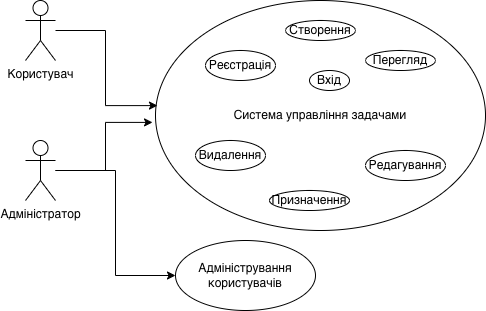

# LAB1-5: Діаграма прецедентів (Use Case)

## 2. Діаграма прецедентів
[AP-16] Розробити діаграму прецедентів (Use Case Diagram), яка відображає взаємодію користувачів із системою.
Нижче наведено діаграму прецедентів, що демонструє основні сценарії взаємодії користувачів із системою.

